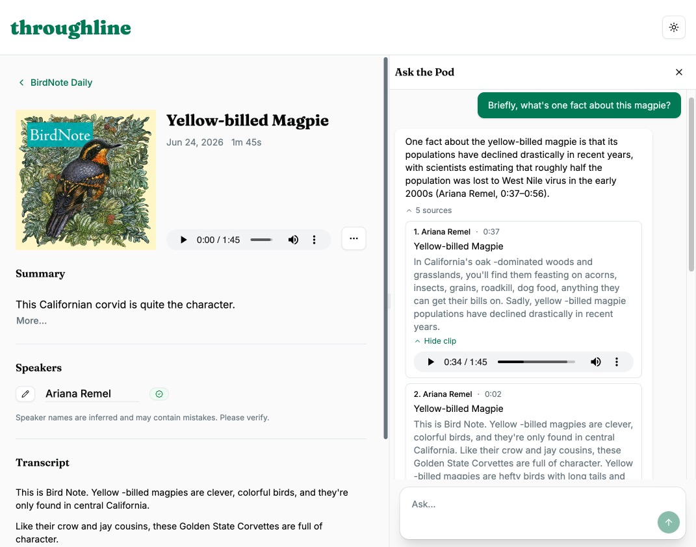
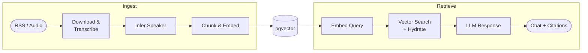

# Throughline: Ask Your Podcasts Anything

Throughline is a self-hosted knowledge engine for podcasts. Ask questions, get answers and citations with speaker attribution.

---



Getting started is straightforward: simply paste a Podcast RSS feed or Apple Podcast URL into the text field, transcribe episodes that interest you, and you're ready to chat.

The application is built with local-first operation in mind, but expandable to use third-party services for transcription, storage, and language model summaries. Episode audio is transcribed and stored in a vector database used for querying through the chat interface. Ask any question about feed or episode contents, speakers' viewpoints, and cross-episode analysis.

**Technical overview / approach:**

* Ingests podcast audio and performs speech-to-text transcription with sentence-level timestamps using a Whisper family model.
* Speaker name is inferred from the transcription content (multi-speaker diarization coming soon).
* Data is chunked and embedded into the vector database.
* Serves chat interface for conversational RAG with source and speaker attribution.
* SSE connections keep the episode frontend state consistent with pipeline progress.
* Tracing and telemetry data are available through any OpenTelemetry OTEL/HTTP connector.

For a deeper look at the decisions made along the way, see `ARCHITECTURE.md`, `IMPLEMENTATION_PLAN.md`, `FUTURE_SCOPE.md`, and `OPERATIONS.md`.

---

## Pipeline

The ingestion pipeline and retrieval flow are fairly straightforward from a high level view. See the backend and frontend README docs as well as the project steering docs such as ARCHITECTURE.md for more details.




## Stack

**Backend:** Python, FastAPI, PostgreSQL + pgvector, SSE, Whisper, OpenAI-compliant endpoints

**Frontend:** Typescript, React + Vite, Axios, TanStack Query, React Router, TailwindCSS, shadcn/ui


## Architecture

The core of the ingestion service relies on an orchestrator pipeline that delegates various responsibilities and business logic to well-defined components, none of which are tightly coupled or have knowledge of each other or the pipeline state. The backend is designed to make extending and changing services easier and with less risk.

This project is intended to work local-first, using local compute through services such as faster_whisper/mlx_whisper, oMLX, Ollama, and llama-server, but capable of utilizing external APIs, interfacing with most OpenAI-compatible endpoints, including OpenAI, Anthropic, and various other cloud providers.

Data is stored in PostgreSQL + pgvector for performance and its wide availability, whether running locally or in the cloud.

On the frontend, TanStack Query enables data syncing between backend and client side with little boilerplate. Shadcn/ui + Tailwind afford consistent UI layout patterns to be used in any kind of design. Because shadcn/ui copies components into the project by convention, they are easily customizable - something not possible with many UI frameworks.


## Bootstrapping

Two ways to run: local dev (recommended for development) or Docker/Podman (recommended for demos).

Both require external services for LLM inference and embeddings - local or cloud, your choice.

| Service       | What it does             | Options                                                 |
| ------------- | ------------------------ | ------------------------------------------------------- |
| LLM           | Chat + speaker inference | Ollama, MLX, llama-server, OpenAI, Anthropic, etc.      |
| Embeddings    | Semantic search          | Ollama, MLX, llama-server, OpenAI, Anthropic, etc.                 |
| Transcription | Audio → text             | Whisper (local, default) or any compatible HTTP service |

Any OpenAI-compatible endpoint works - set `LLM_BASE_URL`, `LLM_MODEL_NAME`, and `LLM_API_KEY` in `backend/.env`.

> **Transcription note:** Whisper runs in-process by default (`faster_whisper`) and requires no additional setup. `mlx_whisper` is also available for Apple Silicon. If you prefer a separate transcription service, [oMLX](https://github.com/madmachinations/omlx) exposes an OpenAI-compatible `/audio/transcriptions` endpoint, though (audio) file upload size is limited to ~100MB. Ollama does not provide transcription endpoints. A capable local model for this is `mlx-community/Qwen3-ASR-1.7B-8bit`. Set `TRANSCRIPTION_SERVICE_URL=http://localhost:8000` in `backend/.env` to use it.

---

### Option 1 - Local Dev

**Requirements:** Python 3.13+, uv, Node 20+, Yarn, Docker or Podman

```bash
cp backend/.env.example backend/.env
# Set LLM_BASE_URL, LLM_MODEL_NAME at minimum

cp frontend/.env.example frontend/.env
# Defaults work for local dev

# Optional: Skip if you already have postgres db connection; update .env accordingly and run migrations manually - see backend/README.md for steps.
cd backend && ./scripts/bootstrap.sh

# Backend
uv run uvicorn src.api.main:app --reload --port 3001

# Frontend (separate terminal)
cd frontend && yarn && yarn dev
```

> Backend: http://localhost:3001 · Frontend: http://localhost:3000 · API docs: http://localhost:3001/docs

---

### Option 2 - Docker / Podman

**Requirements:** Docker or Podman with Compose

```bash
cp .env.example .env
cp backend/.env.example backend/.env
cp frontend/.env.example frontend/.env
# Set LLM_BASE_URL and LLM_MODEL_NAME in backend/.env

podman compose up --build
```

> App: http://localhost

**Note:** Services on your host machine aren't reachable via `localhost` from inside a container. Use `host.docker.internal` instead for local LLM endpoints:

```dotenv
LLM_BASE_URL=http://host.docker.internal:11434/v1
EMBEDDING_BASE_URL=http://host.docker.internal:11434/v1
```

> **Transciption in Docker:** The default in-process Whisper works without any additional services. For a separate transcription service running on your host, use `http://host.docker.internal:8000` as the `TRANSCRIPTION_SERVICE_URL`.

---

See `backend/README.md` for transcription options, diarization setup, and observability configuration.

---

## Development Approach

This project was built through deliberate and thoughtful collaboration with Claude Sonnet. Architectural decisions, tradeoffs, and product direction were mine. The model contributed structure, general implementation, and boilerplate. The goal was to provide the meaningful direction and co-creation as a learning project, as if pair programming with an engineer on my team, allowing me to move much faster than if developed on my own. This is not a vibe-coded project - every architectural decision has been reasoned through and documented, and in many cases, revised. AI tooling is most useful when you bring enough context and judgement to evaluate what it produces.

---

Thie project is released under the MIT License.